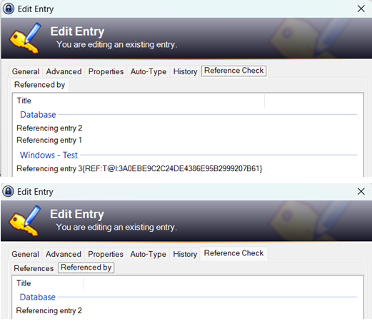
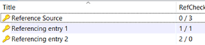
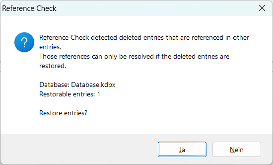

\

[KeePass' field references](https://keepass.info/help/base/fieldrefs.html) allow you to share common fields (user name, password, ...) across multiple entries. After changing the actual data entry, all other entries will also use the new value.

Reference Checker improves handling those field references.
It shows usage of references and prevents accidential deletion of referenced entries which would break them otherwise.

# Table of Contents
- [Configuration](#configuration)
- [Translations](#translations)
- [Download and Requirements](#download-and-requirements)

# Configuration
This plugin has no configuation options, it is either active or inactive.

It adds a new tab in the entry details which will show all references:
* Names of other entries that are referenced in the current entry
* names of other entries that reference the current entry

It also provides a *RefCheck* column that will show the number of references, e. g *1 / 2* meaning: The entry references 1 other entry and is used as reference by 2 entries.  

If you delete an entry that is used as reference, you will be notified and can restore the deleted entry which will make the reference work again.  

# Translations
Reference Checker is provided with english language built-in and allow usage of translation files.
These translation files need to be placed in a folder called *Translations* inside in your plugin folder.
If a text is missing in the translation file, it is backfilled with the english text.
You're welcome to add additional translation files by creating a pull request.

Naming convention for translation files: `<plugin name>.<language identifier>.language.xml`\
Example: `referencecheck.de.language.xml`
  
The language identifier in the filename must match the language identifier inside the KeePass language that you can select using *View -> Change language...*\
If [EarlyUpdateCheck](https://github.com/rookiestyle/earlyupdatecheck) is installed, this identifier is shown there as well.

# Download and Requirements
## Download
Please follow these links to download the plugin file itself.
- [Download newest release](https://github.com/rookiestyle/referencecheck/releases/latest/download/referencecheck.plgx)
- [Download history](https://github.com/rookiestyle/referencecheck/releases)

If you're interested in any of the available translations in addition, please download them from the [Translations](Translations) folder.
## Requirements
* KeePass: 2.39
* .NET framework: 4.0
